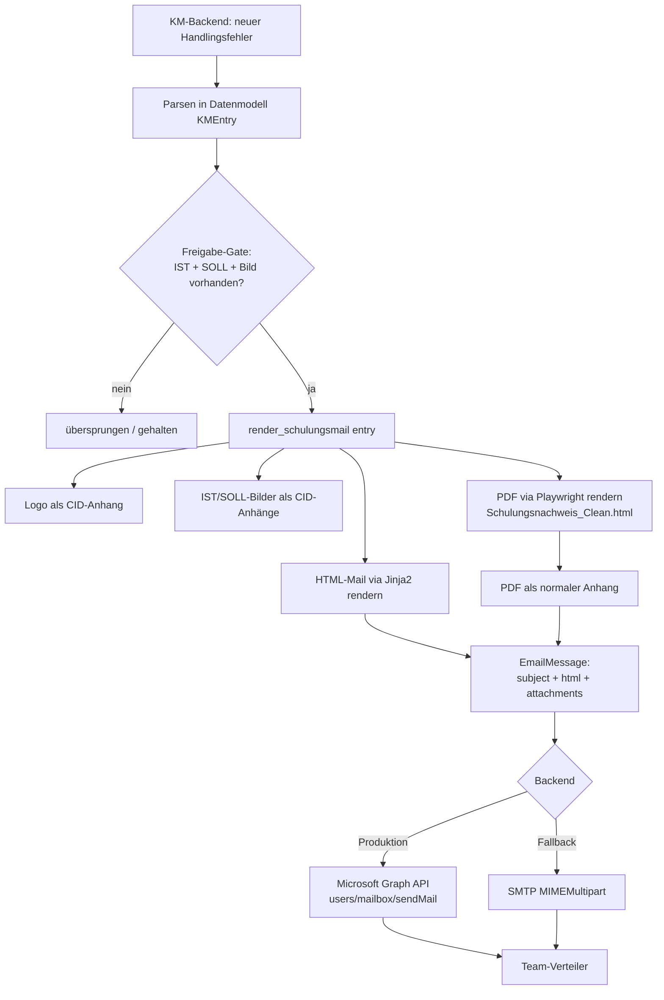

# Nachbau-Dokumentation: E-Mail-Workflow „Schulungsnachweis / One Point Lesson"

> **Zweck dieses Dokuments**
> Diese Doku beschreibt den kompletten E-Mail- + PDF-Workflow der *Handlingsfehler-Middleware*
> so genau, dass eine **andere App den Look, das Layout, die Texte und die technische
> Mechanik 1:1 nachbauen** kann – inklusive des **PDF-Schulungsnachweises im Anhang**.
>
> Die neue App hat einen anderen Datenkontext. Deshalb ist strikt getrennt zwischen
> **(A) Datenvertrag** (welche Felder braucht das Template?) und **(B) Darstellung**
> (Styling, Layout, Texte). Die neue App muss nur ihre eigenen Daten auf den Datenvertrag
> in Kapitel 3 mappen – der Rest (Templates, Farben, Texte) wird 1:1 übernommen.

---

## Inhaltsverzeichnis

1. [Überblick / Was der Workflow tut](#1-überblick)
2. [End-to-End-Ablauf (Pipeline)](#2-end-to-end-ablauf)
3. [Datenvertrag – welche Felder das Template braucht](#3-datenvertrag)
4. [Die E-Mail (HTML-Template + Variablen)](#4-die-e-mail)
5. [Der PDF-Anhang (Schulungsnachweis)](#5-der-pdf-anhang)
6. [Texte – der „positive Flow"](#6-texte--der-positive-flow)
7. [Design-Tokens (Farben, Schriften, Maße)](#7-design-tokens)
8. [Versand-Technik (CID-Bilder, Anhänge, Graph/SMTP)](#8-versand-technik)
9. [Outlook-Fallstricke & bewährte Lösungen](#9-outlook-fallstricke)
10. [Checkliste für den 1:1-Nachbau](#10-checkliste)

Die beiden fertigen Templates liegen als Kopie im Ordner [`templates/`](./templates):
- [`templates/email_handlingsfehler.html`](./templates/email_handlingsfehler.html) – die HTML-Mail
- [`templates/Schulungsnachweis_Clean.html`](./templates/Schulungsnachweis_Clean.html) – das PDF (A4 quer)

---

## 1. Überblick

Aus einem Wissensmanagement-Backend („KM") kommt ein **Handlingsfehler** (eine *One Point
Lesson*): ein kurzer Praxis-Hinweis mit **IST-Zustand** (was war falsch) und **SOLL-Zustand**
(wie es richtig geht), jeweils mit Bild(ern) und Beschreibung, plus Metadaten (Linie, Bereich,
Auswirkung) und Tags.

Die Middleware erzeugt daraus **eine E-Mail an das Produktionsteam**:

- **HTML-Mail** im Querformat-Look mit IST/SOLL-Gegenüberstellung (rot/grün), Meta-Leiste,
  Tag-Pills, positivem Einleitungstext.
- **PDF-Anhang** („Schulungsnachweis"): dieselbe IST/SOLL-Optik als A4-Querformat-Dokument,
  zusätzlich mit **Unterschriftsfeld (Adobe Sign Text-Tags)**.
- Bilder sind **inline** in der Mail (CID) eingebettet; das PDF hängt als **normale Datei** dran.

**Marke/Ton:** „SmartLesson – Praxis-Wissen für die Produktion". Bewusst **kein** Pflicht-/
Kontroll-Ton, sondern unterstützend und positiv („Gemeinsam besser werden").

**Rendering-Stack:**
- Templates: **Jinja2** (Python) – Platzhalter in `{{ ... }}`, Logik in ``.
- E-Mail-Versand: **Microsoft Graph API** (Produktion) oder **SMTP** (Fallback) – austauschbar.
- PDF: **HTML → Playwright/Chromium → PDF** (kein reportlab im aktiven Pfad). Das PDF wird aus
  demselben Design-System gerendert wie die Mail, nur als druckbares A4-Querformat.

---

## 2. End-to-End-Ablauf



**Kernfunktion** (Python, sinngemäß – die neue App baut das Äquivalent):

```python
async def render_schulungsmail(entry, use_cid=True) -> (html_string, attachments):
    # 1) Logo als CID-Inline-Anhang (Fallback: Base64 data-URI)
    # 2) IST-Bilder als CID-Inline-Anhänge  -> ist_image_srcs = ["cid:...", ...]
    # 3) SOLL-Bilder als CID-Inline-Anhänge -> soll_image_srcs = ["cid:...", ...]
    # 4) template_data zusammenstellen (siehe Kapitel 4)
    # 5) HTML = Jinja2("email_handlingsfehler.html").render(**template_data)
    # 6) PDF = generate_schulungsnachweis_html(entry)  -> als normalen Anhang anhängen
    # 7) return html, attachments
```

Der Betreff wird separat gebaut (siehe [Kapitel 6.1](#61-betreffzeile)).

---

## 3. Datenvertrag

Das ist die **einzige Stelle, die die neue App an ihren eigenen Kontext anpassen muss.**
Alle Templates erwarten genau diese Felder. Mappe deine Daten darauf.

### 3.1 Ein „Handlingsfehler" (Entry)

| Feld | Typ | Pflicht | Bedeutung / Beispiel |
|---|---|---|---|
| `id` | string (GUID) | ja | Eindeutige Fall-ID, z. B. `3f224838-81f2-442c-8b68-b3fa00b98241`. In der Anzeige wird nur der **8-stellige Präfix** genutzt (`#3f224838`). |
| `title` | string | ja | Titel des Falls, z. B. „Vectron - UNDICHT - Gequetschte Dichtung". |
| `linie` | string | nein | Fertigungslinie, z. B. „Vectron". Fallback-Anzeige `–`. |
| `bereich` | string | nein | Bereich, z. B. „Vor-Montage". Fallback `–`. |
| `auswirkung` | string | nein | „hoch" / „mittel" / „gering" (steuert optional Farbe). Fallback `–`. |
| `referenz` | string | nein | Referenzdokument/Arbeitsanweisung. Wird nur angezeigt, wenn gesetzt und ≠ `–`. |
| `ist_beschreibung_text` | string | ja¹ | Fließtext „Problem erkannt". Für das PDF wird pro **Zeile** ein Bullet erzeugt. |
| `soll_beschreibung_text` | string | ja¹ | Fließtext „Richtig so – Schritt für Schritt". Ebenfalls zeilenweise zu Bullets. |
| `ist_bilder` | Liste von Bildern | ja¹ | Mind. 1 Bild empfohlen. In der **Mail** werden **alle** IST-Bilder gezeigt, im **PDF** nur das **erste**. |
| `soll_bilder` | Liste von Bildern | nein | Wenn leer → „Kein Vergleichsbild vorhanden"-Fallback (siehe 4.4 / 5.4). |
| `tags` | Liste von `{name, category}` | nein | Für die Tag-Pills. Ein interner Freigabe-Tag wird herausgefiltert (siehe 3.3). |
| `description` | string | nein | Zusatz-Hinweis; im PDF als „⚠️ HINWEIS"-Box unter SOLL. |

¹ Das Freigabe-Gate der Middleware verlangt IST **und** SOLL **und** mindestens ein Bild, bevor
überhaupt versendet wird. Die neue App kann diese Regel übernehmen oder anpassen.

### 3.2 Ein „Bild" (Image)

| Feld | Typ | Bedeutung |
|---|---|---|
| `content` | bytes | Roh-Binärdaten des Bildes (PNG/JPEG). |
| `mime_type` | string | z. B. `image/png`. |

Bilder kommen im KM-Backend als **Base64 in Markdown/HTML** (``
bzw. ``) und werden vor dem Versand in `bytes` dekodiert.
Für die neue App gilt: Egal woher die Bilder stammen – am Ende brauchst du `bytes` + `mime_type`.

### 3.3 Tags für die Anzeige (`get_display_tags`)

- Gibt **alle** Tag-Namen in Originalreihenfolge zurück, **ohne Duplikate**.
- Der interne **Freigabe-Tag** (Workflow-Marker, z. B. `freigegeben`) wird **NICHT** angezeigt.
- Ergebnis ist eine einfache `List[str]`, z. B. `["Vectron", "FPY", "NCC", "Strahler", "Hinweis"]`.

---

## 4. Die E-Mail

**Datei:** [`templates/email_handlingsfehler.html`](./templates/email_handlingsfehler.html)
(vollständig als Kopie beigelegt). Es ist eine klassische, **tabellenbasierte HTML-Mail**
(Outlook-tauglich), Breite **800px**, Querformat-Feeling.

### 4.1 Jinja2-Variablen der Mail

Diese Werte übergibt die App beim Rendern (`template.render(**template_data)`):

| Variable | Typ | Beispiel / Hinweis |
|---|---|---|
| `title` | string | Fall-Titel (Meta-Box-Überschrift + `<title>`). |
| `entry_id` | string | Volle GUID. Im Template wird `{{ entry_id[:8] }}` als Fall-Nr. angezeigt und `{{ entry_id }}` in der Fußzeile (Ref). |
| `linie` | string | Meta-Leiste. |
| `bereich` | string | Meta-Leiste. |
| `auswirkung` | string | Meta-Leiste – wird nur gezeigt, wenn gesetzt und ≠ `–`. |
| `tags` | list[str] | Tag-Pills. Wenn leer → kein Tag-Block. |
| `logo_src` | string | `cid:siemens_logo` (oder Base64-`data:`-URI). Leer → Text-Fallback „Siemens Healthineers". |
| `ist_image_srcs` | list[str] | Liste von `cid:`-Referenzen (oder `data:`-URIs) der IST-Bilder. |
| `soll_image_srcs` | list[str] | Analog für SOLL. Leer → Kein-Bild-Fallback. |
| `ist_beschreibung` | string | Text unter „Problem erkannt:". |
| `soll_beschreibung` | string | Text unter „Richtig so:". |
| `from_address` | string | Absenderadresse (Fußzeile, Ref-Zeile). |

> **Hinweis zu `auswirkung`:** Die Middleware berechnet zusätzlich `auswirkung_color`
> (`hoch`→`#D32F2F`, `mittel`→`#FF7900`, `gering`→`#388E3C`) und `auswirkung_bars` (3/2/1).
> Das aktuelle Mail-Template nutzt sie derzeit nicht aktiv, sie stehen aber bereit, falls die
> neue App eine farbige Ampel/Balken-Anzeige möchte.

### 4.2 Aufbau der Mail (von oben nach unten)

1. **Header:** links Titelzeile „SCHULUNGSNACHWEIS – ONE POINT LESSON" (Bree-SH-Fontstack),
   rechts das Logo (oder Text-Fallback).
2. **Oranger Trennstrich** (2px, `#FF7900`) – als Outlook-sichere `bgcolor`-Zelle, **nicht** als
   CSS-`border` (siehe Kapitel 9).
3. **Intro-Text** (positiver Flow, siehe [Kapitel 6.2](#62-intro-text-in-der-mail)):
   fette Headline „Neues Praxis-Wissen für euch" + zwei Absätze.
4. **Meta-Leiste** (grauer Kasten `#F5F5F5`, Radius 10px): Fall-Titel, dann Fall-Nr./Linie/
   Bereich/Auswirkung, darunter die **Tag-Pills**.
5. **IST/SOLL-Gegenüberstellung** (Herzstück): echte 2-Spalten-Tabelle (`table-layout:fixed`),
   damit beide Spalten in Outlook exakt gleich hoch sind:
   - **links IST:** Kopf `#E8959F` (rosa/rot) „FEHLER – IST-Zustand", Body `#FFF5F5`, Bild(er),
     „Problem erkannt:" + Text.
   - **rechts SOLL:** Kopf `#7DC89F` (grün) „KORREKT – SOLL-Zustand", Body `#F0FDF4`, Bild(er)
     oder Kein-Bild-Fallback, „Richtig so:" + Text.
6. **Info-Leiste** (2 graue Kästen nebeneinander): „Schulungsnachweis als PDF" + „Gemeinsam
   besser werden".
7. **Footer:** „Siemens Healthineers | HEP06 | Qualitätswissen für die Produktion", Hinweistext,
   Ref-Zeile (`entry_id` + `from_address`).
8. **Oranger Abschlussbalken** unten (4px, `#FF7900`, abgerundete Ecken).

### 4.3 Responsives Verhalten

Eine Media Query `@media only screen and (max-width: 820px)` bricht die zweispaltigen Blöcke
(`.col-half`) auf volle Breite um und lässt die Tag-Pills umbrechen (`.tag-cell` → `inline-block`,
`.tag-spacer` verschwindet). Desktop-Outlook ignoriert Media Queries → bleibt einspaltig-nebeneinander.

### 4.4 Kein-Bild-Fallback (SOLL)

Wenn `soll_image_srcs` leer ist, zeigt die SOLL-Spalte statt eines nackten Platzhalters:

> **Kein Vergleichsbild vorhanden** — Für diesen Hinweis gibt es keinen bildlichen Soll-Zustand –
> bitte die Beschreibung beachten.

(gestrichelter Rahmen `#B8DCC6`, Hintergrund `#F0FAF0`).

---

## 5. Der PDF-Anhang

**Datei:** [`templates/Schulungsnachweis_Clean.html`](./templates/Schulungsnachweis_Clean.html)
(vollständig beigelegt). Dieses HTML wird via **Playwright/Chromium** zu einem **A4-Querformat-PDF**
gerendert und als **normaler Anhang** an die Mail gehängt (Dateiname z. B.
`Schulungsnachweis_3f224838.pdf`).

### 5.1 Rendering-Rezept (Python, sinngemäß)

```python
async def generate_schulungsnachweis_html(entry, template_name="Schulungsnachweis_Clean.html"):
    env = Environment(loader=FileSystemLoader(templates_dir))
    template = env.get_template(template_name)

    # Bilder als Base64 (NICHT CID – das PDF ist ein eigenständiges Dokument):
    ist_bild_b64  = base64(entry.ist_bilder[0].content)   if entry.ist_bilder  else ""
    soll_bild_b64 = base64(entry.soll_bilder[0].content)  if entry.soll_bilder else ""
    logo_b64      = base64(read("siemens_logo.png"))

    # Corporate-Fonts als @font-face(base64) einbetten (siehe 7.2):
    font_face_css = build_font_face_css()

    # Beschreibungen zeilenweise in Bullet-Listen splitten:
    ist_punkte  = [zeile for zeile in entry.ist_beschreibung_text.splitlines()  if zeile.strip()]
    soll_punkte = [zeile for zeile in entry.soll_beschreibung_text.splitlines() if zeile.strip()]

    html = template.render(
        entry_title=entry.title,
        entry_id_short=entry.id[:8] + "...",
        linie=entry.linie or "–", bereich=entry.bereich or "–",
        auswirkung=entry.auswirkung or "–",
        datum=now("%d.%m.%Y"), referenz=entry.referenz or "–",
        created_at=now("%d.%m.%Y %H:%M"),
        ist_bild_b64=ist_bild_b64, soll_bild_b64=soll_bild_b64, logo_b64=logo_b64,
        ist_punkte=ist_punkte, soll_punkte=soll_punkte,
        tags=entry.get_display_tags(),
        beschreibung=entry.description or "",
        font_face_css=font_face_css,
    )

    # Playwright: HTML -> PDF (A4 quer, Hintergründe drucken!)
    async with async_playwright() as p:
        browser = await p.chromium.launch(headless=True)
        page = await browser.new_page()
        await page.set_content(html, wait_until="networkidle")
        pdf_bytes = await page.pdf(format="A4", landscape=True, print_background=True)
        await browser.close()
    return pdf_bytes
```

> **Wichtig:** `set_content` rendert **ohne Base-URL** → alle Assets (Bilder, Logo, Schriften)
> müssen als `data:`-URI / Base64 **eingebettet** sein. `print_background=True` ist Pflicht,
> sonst fehlen die farbigen IST/SOLL-Flächen im PDF.

### 5.2 Jinja2-Variablen des PDF

| Variable | Typ | Bedeutung |
|---|---|---|
| `entry_title` | string | Titel im grauen Titel-Meta-Kasten. |
| `entry_id_short` | string | 8-stelliger ID-Präfix → „Fall-Nr. #…". |
| `linie`, `bereich`, `auswirkung` | string | Meta-Zeile (je nur angezeigt, wenn ≠ `–`). |
| `datum` | string | `TT.MM.JJJJ` (Erstelldatum). |
| `referenz` | string | Wird als „📋 Referenz"-Box unter IST **und** in der Meta-Zeile gezeigt (nur wenn ≠ `–`). |
| `created_at` | string | `TT.MM.JJJJ HH:MM` – Fußzeile. |
| `logo_b64` | base64 | Logo (PNG) – oben rechts. |
| `ist_bild_b64` | base64 | Erstes IST-Bild. |
| `soll_bild_b64` | base64 | Erstes SOLL-Bild (leer → Kein-Bild-Fallback). |
| `ist_punkte` | list[str] | Bullet-Liste „Problem erkannt:". |
| `soll_punkte` | list[str] | Bullet-Liste „Richtig so – Schritt für Schritt:". |
| `tags` | list[str] | Tag-Chips im Titel-Kasten. |
| `beschreibung` | string | „⚠️ HINWEIS"-Box unter SOLL (nur wenn gesetzt). |
| `font_face_css` | raw CSS | Base64-`@font-face`-Regeln (siehe 7.2). Als `{{ font_face_css }}` in `<style>`. |

### 5.3 Aufbau des PDF (A4 quer, 297×210 mm)

1. **Header:** Titel „SCHULUNGSNACHWEIS – ONE POINT LESSON" (Bree SH), Logo rechts.
2. **Oranger Trennstrich** (2,5px, `#FF7900`).
3. **Titel-Meta-Kasten** (`#ECECEC`): Fall-Titel + Meta-Zeile (Fall-Nr., Linie, Bereich,
   Auswirkung, Datum, Referenz) + Tag-Chips.
4. **IST/SOLL-Grid** (CSS `grid-template-columns: 1fr 1fr`):
   - **IST** (`.section.ist`, Body `#FFF5F5`, Kopf `#F0A5B0`): „❌ [FEHLER] IST-Zustand",
     Bild (max. Höhe 78mm), Bullet-Liste, optional Referenz-Box.
   - **SOLL** (`.section.soll`, Body `#F0FDF4`, Kopf `#9DD4B2`): „✅ [KORREKT] SOLL-Zustand",
     Bild oder Kein-Bild-Fallback, Bullet-Liste, optional HINWEIS-Box.
5. **Bestätigungsblock** (`#ECECEC`): Bestätigungssatz + **Signaturraster** (Unterschrift /
   Name / Datum) mit **Adobe Sign Text-Tags** (siehe 5.5).
6. **Footer:** „SIEMENS HEALTHINEERS | HEP" links, „Erstellt durch: Handlingsfehler-Middleware |
   {created_at}" rechts.

### 5.4 Kein-Bild-Fallback (PDF, SOLL)

Analog zur Mail: „**Kein Vergleichsbild vorhanden** – Für diesen Hinweis gibt es keinen
bildlichen Soll-Zustand. Bitte die Beschreibung und Referenz unten beachten."

### 5.5 Adobe Sign Text-Tags (Unterschriftsfeld)

Im Bestätigungsblock stehen drei Text-Tags, die Adobe Sign automatisch in interaktive
Formularfelder umwandelt. Sie müssen als **wörtlicher Text** im PDF stehen (im Jinja-Template
über `…` geschützt, damit Jinja sie nicht als eigene Syntax interpretiert):

| Rolle | Tag |
|---|---|
| Unterschrift | `{{Sig_es_:signer1:signature}}` |
| Name (auto) | `{{N_es_:signer1:fullname}}` |
| Datum (auto) | `{{Dte_es_:signer1:date}}` |

Format: `TagName_es_:RollenName:FeldTyp`. Die Tags sind hellgrau (`#999999`), damit sie im PDF
kaum stören; Adobe Sign überdeckt sie mit den echten Feldern. Wenn die neue App **kein** Adobe
Sign nutzt, können die Tags durch klassische Unterschriftslinien ersetzt werden – Layout bleibt gleich.

---

## 6. Texte – der „positive Flow"

Der Ton ist der wichtigste inhaltliche Baustein: **unterstützend, nicht kontrollierend.**
Alle Texte unten sind 1:1 übernehmbar.

### 6.1 Betreffzeile

Marke **„SmartLesson"** statt „Schulungspflicht". Format:

```
SmartLesson · {Produkt}: {Titel}
```

- `{Produkt}` = Name des Product-Tags (z. B. „Vectron"), ersatzweise `linie`.
- Beginnt der Titel bereits mit dem Produktnamen, wird das Produkt **nicht** doppelt vorangestellt
  → dann nur `SmartLesson · {Titel}`.
- Fehlt Produkt **und** Linie → `SmartLesson · {Titel}`.

### 6.2 Intro-Text in der Mail

**Headline (fett, Bree-SH-Fontstack, dunkelviolett `#1B1534`):**

> Neues Praxis-Wissen für euch

**Absatz 1:**

> Hallo zusammen, aus der Produktion ist ein neuer Hinweis eingegangen, der euch bei der
> täglichen Arbeit unterstützen kann. Wir möchten sicherstellen, dass **alle im Team** die
> gleichen Infos haben – deshalb erhält jeder diese Nachricht.

**Absatz 2:**

> Diese Hinweise helfen, typische Stolperfallen frühzeitig zu erkennen und gemeinsam besser
> zu werden. Es geht nicht um Kontrolle – sondern darum, euch bestmöglich zu informieren und
> zu unterstützen. **Kurz reinschauen lohnt sich!**

**Preheader (versteckter Vorschautext):**

> Neues Praxis-Wissen: {title} – Kurz reinschauen lohnt sich!

### 6.3 Info-Leiste (zwei Kästen unter IST/SOLL)

**Kasten „Schulungsnachweis als PDF":**

> Im Anhang findest du den vollständigen Schulungsnachweis – ideal zum Nachschlagen oder
> Ausdrucken am Arbeitsplatz.

**Kasten „Gemeinsam besser werden":**

> Diese Info geht an das gesamte Team – nicht an dich persönlich. Wir teilen Erfahrungen,
> damit alle davon profitieren.

### 6.4 Footer der Mail

> **Siemens Healthineers** | HEP06 | Qualitätswissen für die Produktion
>
> Du erhältst diese Nachricht, weil du Teil des Produktionsteams bist. Bei Fragen wende dich
> an deinen Schichtleiter oder Bereichsverantwortlichen.
>
> Ref: {entry_id} | {from_address}

### 6.5 Plain-Text-Variante (für Mail-Clients ohne HTML)

```
SmartLesson – Praxis-Wissen für die Produktion

{title}
Linie: {linie}
Bereich: {bereich}
Auswirkung: {auswirkung}

Was ist passiert (IST):
{ist_beschreibung_text}

So geht es richtig (SOLL):
{soll_beschreibung_text}

Diese Info geht an das ganze Team – nicht an dich persönlich. Wir teilen Erfahrungen,
damit alle davon profitieren. Im Anhang findest du den Schulungsnachweis als PDF zum Nachschlagen.

---
Siemens Healthineers | SHS Qualitätsteam Produktion
Diese E-Mail wurde automatisch versendet.
```

### 6.6 Bestätigungssatz im PDF

> Ich bestätige mit meiner Unterschrift, dass ich diesen Handlingsfehler verstanden habe und
> die korrekten Maßnahmen in meiner täglichen Arbeit beachten werde.

### 6.7 Feste Beschriftungen (Labels)

| Ort | Text |
|---|---|
| Mail IST-Kopf | `FEHLER – IST-Zustand` |
| Mail SOLL-Kopf | `KORREKT – SOLL-Zustand` |
| PDF IST-Kopf | `❌ [FEHLER] IST-Zustand` |
| PDF SOLL-Kopf | `✅ [KORREKT] SOLL-Zustand` |
| IST-Liste | „Problem erkannt:" |
| SOLL-Liste (Mail) | „Richtig so:" |
| SOLL-Liste (PDF) | „Richtig so – Schritt für Schritt:" |
| Header-Titel | `SCHULUNGSNACHWEIS – ONE POINT LESSON` |

---

## 7. Design-Tokens

### 7.1 Farben

| Rolle | Hex | Einsatz |
|---|---|---|
| **Siemens Orange** | `#FF7900` | Trennstriche, Tag-Rahmen, Abschlussbalken. Leitfarbe. |
| Textdunkel | `#333333` | Haupttext, Überschriften. |
| Text gedämpft | `#666666` / `#555555` | Beschreibungen, Meta-Werte. |
| Intro-Headline | `#1B1534` | Dunkelviolett, fette Mail-Headline. |
| **IST-Kopf (Mail)** | `#E8959F` | rosa/rot, Header „FEHLER". |
| **IST-Kopf (PDF)** | `#F0A5B0` | rosa/rot. |
| IST-Body | `#FFF5F5` | zart-roter Flächen-Hintergrund. |
| **SOLL-Kopf (Mail)** | `#7DC89F` | grün, Header „KORREKT". |
| **SOLL-Kopf (PDF)** | `#9DD4B2` | grün. |
| SOLL-Body | `#F0FDF4` | zart-grüner Flächen-Hintergrund. |
| Tag-Pill Fläche | `#CCCCCC` (Mail) / `#CCCCCC` (PDF) | grau, mit orangem Rahmen. |
| Tag-Pill Text | `#2E3A45` (Mail) / `#3C4A57` (PDF) | dunkelblaugrau. |
| Meta-Kasten Mail | `#F5F5F5` | grauer Info-/Meta-Block. |
| Meta-Kasten PDF | `#ECECEC` | grauer Titel-/Bestätigungsblock. |
| Mail-Seitenhintergrund | `#F0F0F0` | hinter dem 800px-Container. |
| Container/Karten | `#FFFFFF`, Radius 12px (Mail) | weiße Mailkarte. |
| Auswirkung hoch/mittel/gering | `#D32F2F` / `#FF7900` / `#388E3C` | optionale Ampel. |

### 7.2 Schriften (Corporate Fonts)

- **Headlines:** `Bree SH` (Datei `SH-Bree-Headline-Regular.ttf`, weight 400; optional Oblique/italic).
  Fontstack in der Mail: `'Bree SH','Segoe UI',Arial,sans-serif`.
- **Fließtext:** `Siemens Sans` (`SiemensSans-Roman.ttf` = 400, `SiemensSans-Bold.ttf` = 700).
  Body-Fontstack: `'Siemens Sans',Arial,Helvetica,sans-serif`.
- **Fallback:** In der **E-Mail** rendert Outlook **keine** Webfonts → deshalb überall
  Arial-Fallback im Fontstack. Die Corporate-Fonts sind vor allem im **PDF** relevant.

**Font-Einbettung fürs PDF** (weil `set_content` keine Base-URL hat): Pro Datei eine
`@font-face`-Regel mit Base64-`data:`-URI erzeugen und gesammelt als `font_face_css` ins Template
geben:

```python
def font_face(family, filename, weight="400", style="normal"):
    b64 = base64(read(f"templates/fonts/{filename}"))
    return (f"@font-face{{font-family:'{family}';"
            f"src:url(data:font/ttf;base64,{b64}) format('truetype');"
            f"font-weight:{weight};font-style:{style};font-display:swap;}}")

font_face_css = "".join([
    font_face("Bree SH",      "SH-Bree-Headline-Regular.ttf", "400"),
    font_face("Siemens Sans", "SiemensSans-Roman.ttf",        "400"),
    font_face("Siemens Sans", "SiemensSans-Bold.ttf",         "700"),
])
```

> **Lizenz:** Die Schriftdateien sind lizenzpflichtige Corporate Fonts und liegen **nicht** in
> diesem Doku-Paket. Die neue App muss sie aus der lizenzierten Quelle beziehen und unter
> `templates/fonts/` ablegen. Fehlen sie, greift automatisch der Arial-Fallback (Layout bleibt,
> nur die Schrift ändert sich).

### 7.4 Logo

Das **Siemens-Healthineers-Logo** liegt im Paket unter [`assets/`](./assets) – in zwei Varianten:

| Datei | Einsatz | Einbettung |
|---|---|---|
| `assets/siemens_logo_email.png` | E-Mail-Header (`logo_src`) | als **CID-Inline-Anhang** (`cid:siemens_logo`) |
| `assets/siemens_logo_pdf.png` | PDF-Header (`logo_b64`) | als **Base64**-`data:`-URI im HTML |

Beide zeigen dieselbe Bildmarke (unterschiedliche Auflösung/Zuschnitt). Fehlt das Logo, greift in
der Mail der Text-Fallback „Siemens Healthineers“. Die neue App kann diese Dateien 1:1 übernehmen
oder durch die eigene CI-Marke ersetzen – der Platz im Header bleibt gleich.

### 7.3 Maße / Layout

| Element | Wert |
|---|---|
| Mail-Container | 800px breit, Radius 12px |
| Mail-Innenabstand Header/Sektionen | 22–32px |
| Mail IST/SOLL-Bilder | `width:100%`, `max-width:326px`, Radius 8px |
| Mail-Breakpoint | `max-width: 820px` (einspaltig) |
| PDF-Seite | A4 quer, 297×210 mm, Padding `7mm 12mm 6mm 12mm` |
| PDF-Bildbox | Höhe 78mm, `object-fit: contain` |
| PDF-Trennstrich | 2,5px `#FF7900` |
| PDF Titel-Kasten/Bestätigung | Radius 1,5mm, `#ECECEC` |

Es gibt zusätzlich eine **XXL-Variante** `Schulungsnachweis_Large.html` (Seitenformat 500×300mm,
Schriftgrößen skaliert) für Großdruck/Aushang – gleiches Design, nur größer. Für den Standard-Mail-
Anhang wird immer `Schulungsnachweis_Clean.html` (A4 quer) verwendet.

---

## 8. Versand-Technik

### 8.1 Bilder inline (CID) vs. Base64

- **E-Mail:** Bilder als **CID-Inline-Anhänge** (`Content-ID`), im HTML referenziert als
  `src="cid:xyz"`. Vorteil: zuverlässige Darstellung in Outlook/OWA, keine „Bilder blockiert"-
  Probleme wie bei externen URLs. Alternativ (`use_cid=False`) Base64-`data:`-URIs direkt im HTML.
- **PDF:** Immer **Base64 eingebettet** (eigenständiges Dokument, kein CID).

### 8.2 Anhänge

| Anhang | content_id | Darstellung |
|---|---|---|
| Logo | gesetzt (`siemens_logo`) | inline im Header |
| IST-Bilder | gesetzt (`ist_0_…`) | inline |
| SOLL-Bilder | gesetzt (`soll_0_…`) | inline |
| **PDF-Schulungsnachweis** | **None** | **normaler Datei-Anhang** |

Ein Anhang-Objekt trägt: `filename`, `content` (bytes), `mime_type`, `content_id` (optional).

### 8.3 SMTP-Aufbau (Fallback)

`MIMEMultipart("related")` (Gesamt) → enthält `MIMEMultipart("alternative")` (Plain + HTML) →
plus die Inline-Bilder (`MIMEImage` mit `Content-ID` + `Content-Disposition: inline`) und den
PDF-Anhang (`Content-Disposition: attachment`).

### 8.4 Microsoft Graph API (Produktion)

- OAuth2 **Client-Credentials-Flow** (`tenant_id`, `client_id`, `client_secret`), Token gecacht.
- `POST https://graph.microsoft.com/v1.0/users/{mailbox}/sendMail`.
- Payload: `message.subject`, `message.body{contentType:"HTML", content:html}`,
  `toRecipients[]`, `attachments[]` mit `@odata.type:"#microsoft.graph.fileAttachment"`,
  `name`, `contentBytes` (Base64), `contentType`. Inline-Bilder zusätzlich mit
  `contentId` + `isInline:true`. `saveToSentItems:"true"`.

Beide Backends sind hinter einem gemeinsamen Interface austauschbar – die neue App kann eines
davon (oder ein eigenes) verwenden. Der Render-Teil (Kapitel 4/5) bleibt identisch.

---

## 9. Outlook-Fallstricke

Diese Punkte sind hart erkämpft und für einen 1:1-Look entscheidend:

1. **Tag-Pills als `<td bgcolor="#CCCCCC">`, nicht als `<span>`.** OWA/„neues Outlook" strippt
   `background-color` von `<span>` und `display:inline-block` von verschachtelten Tabellen. Nur das
   HTML-Attribut `bgcolor` an einer `<td>` füllt zuverlässig, und `<td>`-Zellen einer `<tr>` stehen
   am Desktop immer nebeneinander. Umbruch auf Mobil macht eine Media Query (`.tag-cell` →
   `inline-block`). **Nicht** `float` (Treppen-Bug), **nicht** `span+background-color` (leer am PC).
2. **Oranger Trennstrich als `bgcolor`-Zelle** (`<td height="2" bgcolor="#FF7900">`), nicht als
   CSS-`border-top` – sonst verschwindet er in Outlook.
3. **IST/SOLL als echte 2-Spalten-Tabelle** mit `table-layout:fixed` und `height:100%` je Zelle,
   damit beide Spalten exakt gleich hoch sind.
4. **Bilder inline via CID** statt externer URLs (sonst „Bilder werden blockiert").
5. **PDF-Assets als Base64 einbetten** – `set_content` hat keine Base-URL.
6. **`print_background=True`** beim PDF, sonst fehlen die farbigen Flächen.
7. **Webfonts nur im PDF** – in der Mail immer Arial-Fallback im Fontstack lassen.

---

## 10. Checkliste

Für den 1:1-Nachbau in der neuen App:

- [ ] Eigene Daten auf den **Datenvertrag** (Kapitel 3) mappen: `title`, `id`, `linie`, `bereich`,
      `auswirkung`, `referenz`, `ist_beschreibung_text`, `soll_beschreibung_text`,
      `ist_bilder[]`, `soll_bilder[]`, `tags[]`.
- [ ] Bilder als `bytes` + `mime_type` bereitstellen; `get_display_tags()`-Äquivalent bauen
      (Freigabe-Tag ausfiltern).
- [ ] [`email_handlingsfehler.html`](./templates/email_handlingsfehler.html) übernehmen und mit
      den Variablen aus 4.1 rendern.
- [ ] Bilder + Logo als **CID-Inline-Anhänge** anhängen (oder Base64-`data:`-URIs).
- [ ] [`Schulungsnachweis_Clean.html`](./templates/Schulungsnachweis_Clean.html) via
      **Playwright/Chromium** zu **A4-quer-PDF** rendern (`landscape=True`, `print_background=True`),
      Bilder/Logo/Fonts als Base64 einbetten.
- [ ] PDF als **normalen Anhang** (kein `content_id`) an die Mail hängen.
- [ ] **Betreff** nach 6.1 bauen; **Plain-Text-Body** nach 6.5 mitschicken.
- [ ] **Texte** aus Kapitel 6 wörtlich übernehmen (positiver Flow).
- [ ] **Design-Tokens** (Kapitel 7) einhalten: Orange `#FF7900`, IST rosa/rot, SOLL grün,
      Tag-Pills grau + oranger Rahmen, Fonts Bree SH / Siemens Sans (+ Arial-Fallback).
- [ ] **Siemens-Logo** aus [`assets/`](./assets) einbinden: `siemens_logo_email.png` (Mail, via CID),
      `siemens_logo_pdf.png` (PDF, via Base64) – oder durch die eigene CI-Marke ersetzen.
- [ ] **Outlook-Fallstricke** (Kapitel 9) beachten.
- [ ] Corporate-Fonts aus lizenzierter Quelle unter `templates/fonts/` ergänzen (sonst Arial).

---

*Quelle: Handlingsfehler-Middleware (Siemens Healthineers, HEP06). Diese Doku beschreibt den
produktiv laufenden Stand des E-Mail-/PDF-Workflows und ist als reine Nachbau-Referenz gedacht.*
